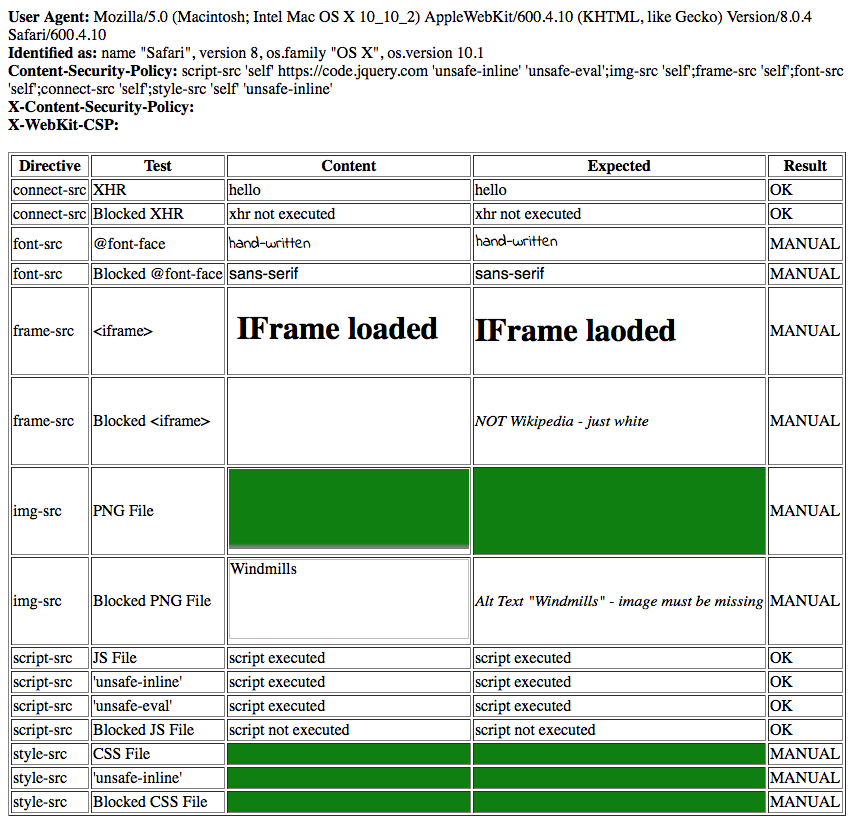

# Test Page for Directive Compatibility

The purpose of this test page is to validate that all directives are correctly assembled for each browser and each browser version.

## Running the Test Page

Currently, the test must be done manually. For that start the server that serves the test page and then open the test page in all browsers you want to test.

From the root of the reposity execute:

```
node ./test/fixtures/directive-compatibility/server.js
```

Open the test page at `http://localhost:3000/`.

## Checking the Results

The test page should look like this:



Ensure that in the "Result" column either "OK" or "MANUAL" is written. "FAILED" would indicate an unexpected behavior.

If "MANUAL" is written in the "Result" column ensure that the columns "Content" and "Expected" match.